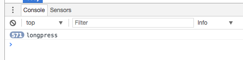
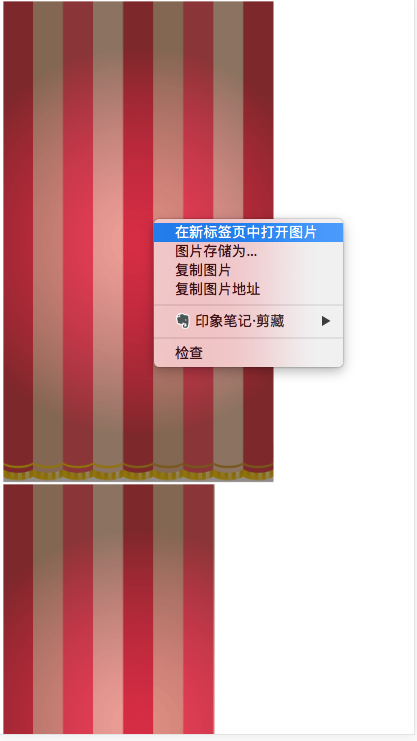
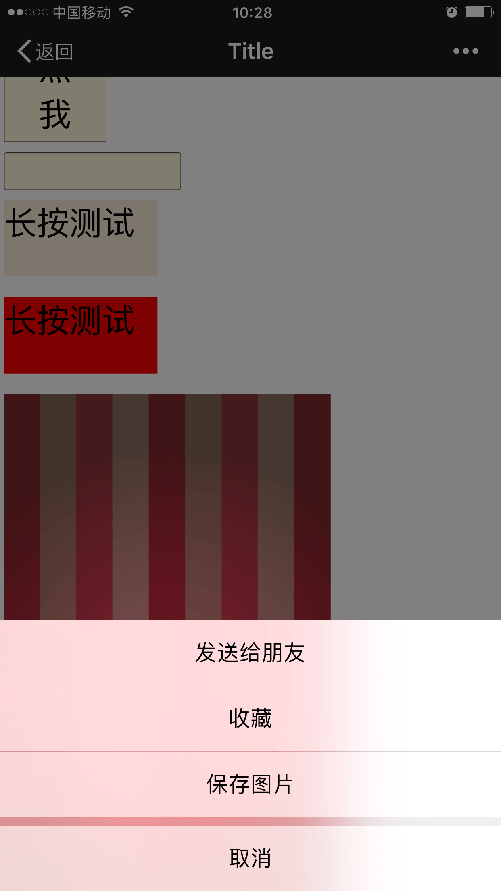
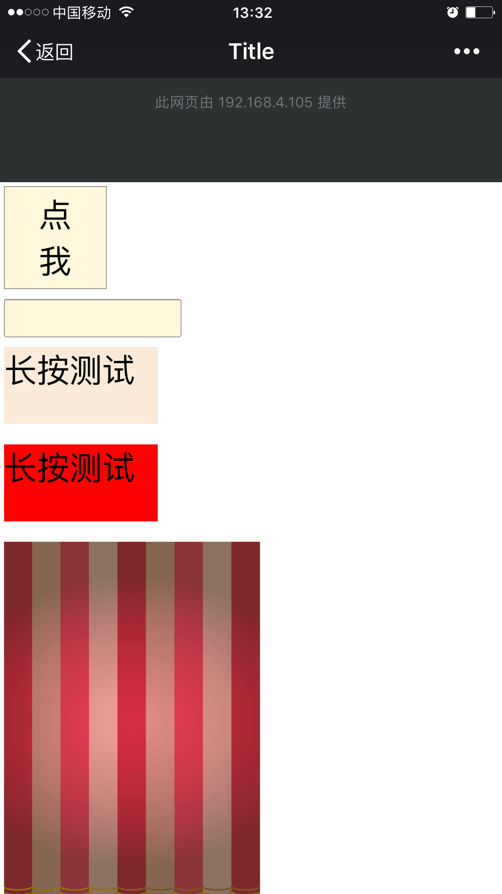

在移动端H5中如果设计了一些需要长按或者滑动的手势操作有可能会和系统默认的一些操作相冲突，所以在编写这些手势时需要做一些特定的处理。为方便代码编写本文使用jQuey库。

## 浏览器默认长按事件

为了更好的测试我们构建一个有多个元素构成的页面

	<body>
		<button style="width: 200px;height: 200px;background-color: cornsilk;font-size: 64px">点我</button>  
		<input style="width: 300px;height: 50px;background-color: cornsilk;font-size: 44px">  
		
长按测试
  
		
长按测试
  
		
	</body>

我们先从chrome开始，虽然我们的目标是移动端，但是为了方便期间都会在chrome上模拟手机端的进行第一步调试。
主要的默认行为是：

* 长按空白处、图片、输入框，弹出默认系统弹框

 

* 长按带有文字的控件会选中文字

 

接下来是iOS
* 长按带有文字的控件会选中文字
* 长按图片会出现保存图像、分享之类的系统菜单
* 长按任何位置出现放大镜

再来安卓：
* 长按带有文字的控件会选中文字或者相同功能的菜单
* 长按图片会出现保存图像、分享之类的系统菜单

在我们需要实现自己的长按手势功能时以上的默认操作都是妨碍我们用户体验的绊脚石，所以我们要把他们一个一个搬掉。

<!--more-->

## 屏蔽系统默认菜单
屏蔽系统默认弹出框可以使用以下代码：

    //屏蔽长按菜单
    document.body.addEventListener('contextmenu', function(e){
        e.preventDefault();
    });

在chrome（PC和Android）、safari上测试下，疗效很好。。。弹出菜单都没有了。虽然在腾讯系的浏览器（QQ浏览器、微信、QQ）上还有问题，但是我们等会儿来处理，先来讲讲上面代码用到的方法和事件。

### oncontextmenu事件

oncontextmenu 事件在元素中用户右击鼠标时触发并打开上下文菜单。为了避免菜单的弹出，我们捕获了body节点的contextmenu事件，并且使用preventDefault阻止其默认动作的触发。

### preventDefault()、stopPropagation()、return false 之间的区别
前面代码用到了`preventDefault`方法，这个方法很常用，但是很容易和`stopPropagation`以及`return false`的用法混淆起来。
具体的区别可以看[这篇文章](http://www.cnblogs.com/dannyxie/p/5642727.html).

简单来讲：

* `preventDefault`阻止浏览器执行默认动作
* `stopPropagation`阻止事件的冒泡上传
* `renturn false`相当于立即退出当前函数并且执行`preventDefault`和`stopPropagation`方法
* `stopImmediatePropagation`立即停止时间继续执行，即使在同一个节点上还绑定了其他事件，这个取决于绑定事件的先后顺序，很危险所以不常用

所以这里的需求我们用`preventDefault`就足够了

## 屏蔽图片弹出菜单
虽然在chrome、safari上屏蔽了默认菜单，但是在腾讯系的浏览器上无论哪个平台点击图片依然会弹出菜单。
翻遍网络并没有直接解决这个弹出菜单的办法可能是在App里面用native代码监控了这个点击事件，所以H5无法跳过这个菜单。
我们只能用曲线救国的方式了：
大致三种方式:
* 使用div，在div的background-image里绘制图片（QQ浏览器里依然有问题，但是微信和QQ上解决问题）
* 使用canvas绘制图片
* 在img上盖一个透明div，在透明div上实现交互操作

以下的代码将使用第三种解决方案：

	

	    
	    

	

## 屏蔽长按选中
使用CSS的方法进行屏蔽：

    *{
        -webkit-touch-callout:none;  /*系统默认菜单被禁用*/
        -webkit-user-select:none; /*webkit浏览器*/
        -khtml-user-select:none; /*早期浏览器*/
        -moz-user-select:none;/*火狐*/
        -ms-user-select:none; /*IE10*/
        user-select:none;
    }

测试一下，长按选中文字、放大镜都没有了，很爽！但是。。。但是！iOS中的input控件也不能输入文字了。。。这还得了，必须要改！！
    
    *:not(input,textarea){
        -webkit-touch-callout:none;  /*系统默认菜单被禁用*/
        -webkit-user-select:none; /*webkit浏览器*/
        -khtml-user-select:none; /*早期浏览器*/
        -moz-user-select:none;/*火狐*/
        -ms-user-select:none; /*IE10*/
        user-select:none;
    }

这下真爽了，唯一的问题是祈祷产品千万不要设计出在input上长按的交互。

到此为止，系统自带的默认长按响应都被我们屏蔽了，唯一有问题的是QQ浏览器，在长按页面空白部位时依然有弹出菜单，这个就真没办法了。。。您还是弄个背景div把页面撑满吧。。。

## 长按手势的实现

在H5中是没有长按这个时间触发的，所以比较麻烦的是必须自己实现长按的手势判断，下面是一个简单的JS判断代码：

    var handle ;
    $("img").on("touchstart",function () {
        clearInterval(handle);
        handle = setInterval(function () {
            console.log("longpress")
        },500)
    }).on("touchend",function () {
        clearInterval(handle);
    })

跑一下在控制台正常输出了longpress，代码在iOS和Android端都好使。

## 滑动
到目前为止还有一个问题，在手机端长按向下滑动会拖动整个页面，如下图：

直觉上我们可以用`preventDefault`禁止浏览器的默认滑动行为，马上试一下：

    $(window).on("touchstart",function (e) {
        e.preventDefault();
    }).on("touchend",function (e) {
        e.preventDefault();
    })

果然好使，我们的问题基本解决了（在屏幕左边向右滑动会后退的问题没法解决，因为这不是h5行为，所以请不要设计屏幕左侧像右滑动的交互）

但是等一等。。。一旦屏蔽了window（或者body）的默认行为，一些控件比如页面上的输入框、按钮都不会触发点击效果，因为touchstart方法被拦截之后那些没有申明touchstart事件的控件的默认响应都被取消了。

稍稍改进下代码，使得button和input能正常操作：

    //屏蔽下拉滑动
    $(window).on("touchstart",function (e) {
        if(e.touches[0].target.nodeName!="BUTTON" && e.touches[0].target.nodeName!="INPUT"){
            e.preventDefault();
        }
    })
    
现在唯一的问题是点在按钮或者输入框上依然可以触发下拉露出黑条。

##完整代码

	<!DOCTYPE html>
	<html lang="en">
	<head>
	    <meta charset="UTF-8">
	    <title>Title</title>
	</head>
	
	
	<body>
		<button style="width: 200px;height: 200px;background-color: cornsilk;font-size: 64px">点我</button>  
		<input style="width: 300px;height: 50px;background-color: cornsilk;font-size: 44px">  
		
长按测试
  
		
长按测试
  
		

		    
		    

		

	</body>
	</html>
	
	
	
	
	https://segmentfault.com/a/1190000003810312