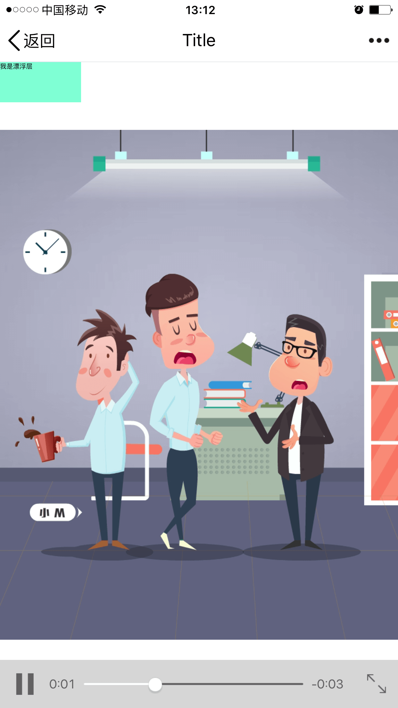
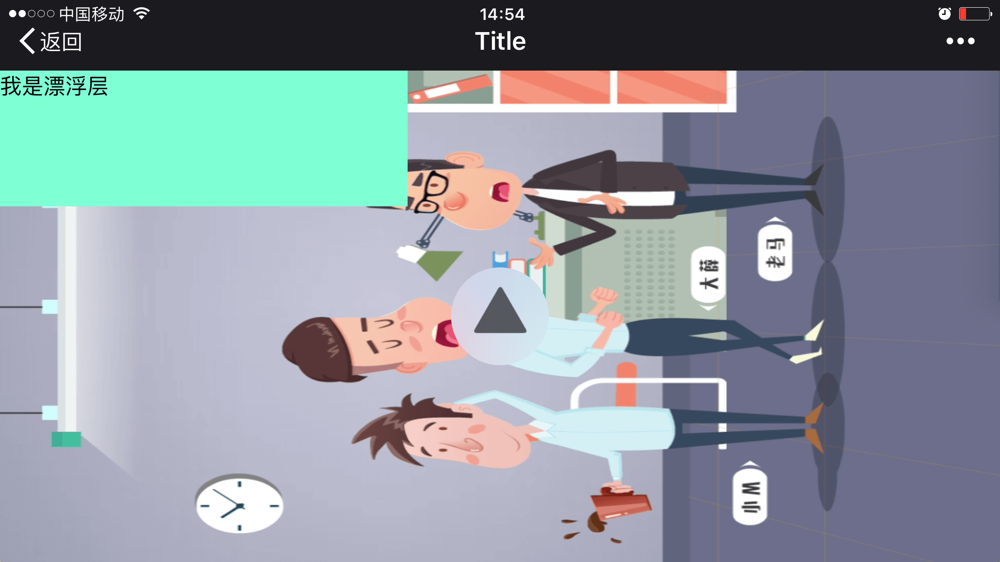

项目要求一个在微信可全屏可交互的视频，稍微做了一些研究，稍作一点总结

## &lt;video/&gt;标签

`video`标签最简单的用法

	<video src="movie.ogg" controls="controls">   
	您的浏览器不支持 video 标签。   
	</video>;
	
或者，根据浏览器支持的视频类型播放不同的格式:

	<video src="movie.ogg" controls="controls">
		<source src="movie.ogg" type="video/ogg" />
  		<source src="movie.mp4" type="video/mp4" />   
		您的浏览器不支持 video 标签。   
	</video>;

`video`标签有几个常用的属性:  

属性       | 值         | 描述     |
----------|------------|---------|
autoplay	| autoplay   | 如果出现该属性，则视频在就绪后马上播放。
controls	| controls   | 如果出现该属性，则向用户显示控件，比如播放按钮。
height    | pixels	   | 设置视频播放器的高度。
loop      | loop       | 如果出现该属性，则当媒介文件完成播放后再次开始播放。
preload   | preload	   | 如果出现该属性，则视频在页面加载时进行加载，并预备播放。如果使用 "autoplay"，则忽略该属性。规定是否预加载视频。 可能的值： auto - 当页面加载后载入整个视频  meta - 当页面加载后只载入元数据 none - 当页面加载后不载入视频
src       | url        | 要播放的视频的 URL。
width     | pixels     | 设置视频播放器的宽度。
poster    | url        | 定视频下载时显示的图像，或者在用户点击播放按钮前显示的图像。如果未设置该属性，则使用视频的第一帧来代替。规定图像文件的 URL。 可能的值： 绝对 URL - 指向另一个网站（比如 href="http://www.example.com/poster.jpg"） 相对 URL - 指向网站内的文件（href="poster.jpg"）
width     | pixels     | 设置视频播放器的宽度。
autoplay  | autoplay   | 规定一旦视频就绪马上开始播放。如果设置了该属性，视频将自动播放。 但是这个属性在移动端大多不能使用，如iOS的要求至少有一次用户触摸事件之后才能开始播放视频。

以上是浏览器通用属性，接下来是几个比较特殊的播放属性：

属性                        | 值        | 描述     |
---------------------------|-----------|---------|
webkit-playsinline         | true      | 视频播放时局域播放，不脱离文档流 。但是在安卓中并没有作用 |
x5-video-player-type       | h5        | 启用同层H5播放器，就是在视频全屏的时候，div可以呈现在视频层上，也是WeChat安卓版特有的属性。同层播放别名也叫做沉浸式播放，播放的时候看似全屏，但是已经除去了control和微信的导航栏，只留下"X"和"<"两键。目前的同层播放器只在Android（包括微信）上生效，|
x5-video-orientation       | portraint | 声明播放器支持的方向，可选值landscape 横屏,portraint竖屏。默认值portraint。无论是直播还是全屏H5一般都是竖屏播放，但是这个属性需要x5-video-player-type开启H5模式 |
x5-video-player-fullscreen | true      | 全屏设置。ture和false的设置会导致布局上的不一样 |

<!--more-->
	
## 同层播放
如过使用前文中提到的最简单的视频播放代码：

	<video src=d.mp4 controls="controls">
	    您的浏览器不支持 video 标签。
	</video>

iOS中点击播放会放大全屏播放；Android中点击播放之后会出现一个漂浮于最上层的视频播放窗口，再点击可放大播放。无论哪个系统默认video播放都不能将其他div覆盖在正在播放的video只上，交互更是无从谈起。

我们所说同层播放可定义为，在原始h5页面中播放视频，不自动全屏最大化，可折叠其他div层与视频只上并完成交互。接下来我们就要为了完成这个目标进行探索。

### iOS中的同层播放
根据我们可以尝试使用webkit-playsinline和playsinline来实现同层播放
  
	<video src=d.mp4 controls="controls" webkit-playsinline="true" playsinline="true">
	    您的浏览器不支持 video 标签。
	</video>

效果很显著，视频不再自动最大化，并且可以在视频上叠上其他div层了。
 

接下来要做的就是把视频根据屏幕自适应全屏化，思路是使用js获取页面展示界面的长款，然后使video标签绝对定位并且设置响应的长和宽

	<video id="testVideo" src=d.mp4 controls="controls" webkit-playsinline="true" playsinline="true" style="position: absolute;left:0;top: 0;">
	    您的浏览器不支持 video 标签。
	</video>
	
我是漂浮层

	

或者更简单的直接设置video中的width和height属性为100%。。。

 
 
根据控制条的位置可以判断视频确实全屏了，这里有个问题是视频并没有像我们想想的那样被全屏拉伸，而只是保持了长宽比之后根据最大的缩放尺度拉伸之后居中播放，显然跟我们的要求有点出入，但是没关系，这问题我们放到以后再讲，先去解决android的问题。

### Android中的同层播放
俺们先打开安卓中的chrome浏览器，因为据说iOS中的浏览器都使用了chrome相同的内核。
 

果然效果杠杠的，除了视频比例有点问题外其他完美。我们接着用系统自带浏览器打开，也没问题。

最后我们用微信（或者QQ）打开链接，毫无悬念的出现了问题（废话，要是就这么简单，我就写blog了），在微信中点击播放之后又成了全屏播放。并且无法覆盖div层。

 
究其原因iOS微信浏览器是Chrome内核，支持playsinline属性，安卓微信浏览器是腾讯X5内核，playsinline属性是不支持的，因此，始终是全屏。

如果你看过一些腾讯的视频类 HTML5，会发现它们在微信里是可以内联播放的，而这个功能在以前是需要申请加入白名单的。

不过新版的 TBS 内核（>=036849）支持一个叫 同层播放器。为了实现全屏播放播放交互功能，我们需要去了解QQ浏览器内核里关于同层播放的设定，查看腾讯官方的文档:[《H5同层播放器接入规范》](https://x5.tencent.com/tbs/guide/video.html)

很容易知道我们需要使用`x5-video-player-type`、`x5-video-player-fullscreen`、`x5-video-orientation`三个特殊的属性。
关键的是`x5-video-player-type=h5`这个属性，我们来修改下原来的代码：

	<video id="testVideo" src=d.mp4 controls="controls" webkit-playsinline="true" playsinline="true" 
			x5-video-player-fullscreen="true" x5-video-player-type="h5" x5-video-orientation="portrait" 
			style="position: absolute;left:0;top: 0;">
	    您的浏览器不支持 video 标签。
	</video>

看上去还成，但是尼玛为什么上下还是回留有黑边呢？再仔细翻翻规范，回发现如下这段话：
	x5-video-player-fullscreen全屏方式
	
	视频播放时将会进入到全屏模式
	
	如果不申明此属性，页面得到视口区域为原始视口大小(视频未播放前)，比如在微信里，会有一个常驻的标题栏，如果不声明此属性，这个标题栏高度不会给页面，播放时会平均分为两块（上下黑块）
	
	注： 声明此属性，需要页面自己重新适配新的视口大小变化。可以通过监听resize 事件来实现
	需要监听窗口大小变化(resize)实现全屏

	window.onresize = function(){
	  test_video.style.width = window.innerWidth + "px";
	  test_video.style.height = window.innerHeight + "px";
	}
	
我们修改原来的JS代码：
	

感觉上基本完美了（左上和右上的两个按钮是真没法去掉了。。。）

### native的设置
最后一个问题，如果我们想把页面在自己的native APP中展示在iOS端还需要设置以下UIWebView的一个属性：

	_web.allowsInlineMediaPlayback = YES;

接下来我们需要把视频全屏拉伸。

## 缩放视频

普通情况下视频只能被保持比例缩放，如果想不按任意缩放，需要采取一些非常之手段。。。

最简单的是使用style里面的object-fit:fill;属性

是不是看着已经很完美了。。。但是这个属性有一个缺点就是兼容性不是很好，简单说安卓要4.4.3才能支持这个属性。截至到今天（2017年7月）安卓4.4以下版本占有率还有10%左右，如果还是有必要对这部分用户进行适配的。主要可以参看这篇文章:[巧用transform实现HTML5 video标签视频比例拉伸](http://www.cnblogs.com/liuxianan/p/html5-video-resize.html)
核心思想就是算出视频长、宽和屏幕长、宽的最大比例差，然后按这个比例缩放之后，再旋转另一边，使其能适应屏幕尺寸，以下是我写的代码，使用了jQuery：

	

我手贱把系统升级到6.0了所以就不截图了，哇哈哈哈哈。

### 封面缩放
为了美观期间经常需要给视频打上个封面，需要用到poster属性，post规定视频下载时显示的图像，或者在用户点击播放按钮前显示的图像。如果未设置该属性，则使用视频的第一帧来代替。
当我们使用了object-fit:fill;属性，封面也能够按照屏幕自适应拉伸了，甚好！

## 横屏播放
一个移动端全屏视频项目总是会预设此项目应该以横屏还是竖屏的方式展现，如果一旦用户不小心改变了横、竖屏的状态，很可能导致许多显示和交互上的问题，由于在H5中无法限制用户转屏，所以很有必要在检测出屏幕比例不对时，采取一些响应的措施去弥补。

### 提示用户

最简单的方案是当屏幕不是我们需要的状态时给用户一个提示，让用户改变当前转屏状态。
方法是绑定`window.onorientationchange`事件，判断`window.orientation`属性，该属性为0时表示竖屏，90或-90时为横屏。

### 自动转屏
这个方案比较复杂，就是如果用户在横屏状态，但是我们的设计又要求是竖屏播放，那就把页面反方向旋转90度，是屏幕依然是竖屏的，入下图所示：

代码如下：

    window.onload = function () {
        resizeVideo()
    }

    window.onresize = function () {
        setTimeout(function () {
            resizeVideo()
        },100)
    }

    function resizeVideo(){
        var v = document.getElementById("testVideo");
        $("#testVideo").css('transform',"rotate(0deg)");
        v.width = innerWidth;
        v.height = innerHeight;
        if(v.width>v.height){
            var angle = window.orientation?window.orientation:screen.orientation.angle;
            v.width = innerHeight;
            v.height = innerWidth;
            var sub = (innerWidth - innerHeight)/2
            $("#testVideo").css('transform',"rotate("+angle*(-1)+"deg) translate("+sub+"px,"+sub+"px)")
        }
    }

首先根据长宽差判断当前屏幕旋转状态，当宽度大于长度时就认为当前处于横屏状态，于是取得翻转角度后进行反向翻转，然后进行平移，使得翻转后的图像依然在屏幕正中，当然我们的覆盖层也要相应的进行旋转并调整屏幕大小，挺麻烦的，但是话说回来了。。。谁真的会在横屏状态下去操作翻转90度的东西呢？意思意思得了。。。

## 完整测试代码
	<html>
	<head>
	    <meta charset="utf-8">
	    <meta name="viewport" content="width=device-width,initial-scale=1.0, user-scalable=no,minimal-ui ">
	    <title>Title</title>
	    
	</head>
	<body style="margin: 0 auto;overflow: hidden">                                                                                                                                                                                                                                                                                                                                                                                                                                                                                                                                                                                                                                                                                                                                                                                                                                                                                                                                                                                                                                                                                                                                                                                                                                                                                                                                                                                                                                                                                                                                                                                                                                                                                                                                                                                                                                                                                                                                                                                                                                                                                                                                      ">
	    <video id="testVideo" src=d.mp4 controls="controls" webkit-playsinline="true" playsinline="true"
	           x5-video-player-fullscreen="true" x5-video-player-type="h5" x5-video-orientation="portrait"
	           style="position: absolute;left:0;top: 0;object-fit:fill;"
	           poster="poster.png">
	        您的浏览器不支持 video 标签。
	    </video>
	    
我是漂浮层

	</body>
	</html>
	

## 主要参考：
* http://www.cnblogs.com/2050/p/3877280.html
* http://www.cnblogs.com/liuxianan/p/html5-video-resize.html