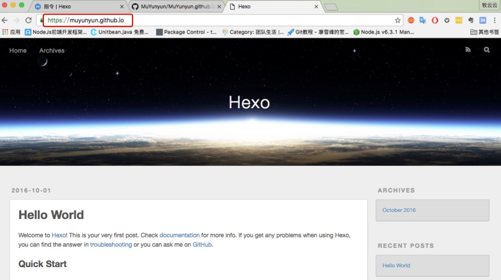

　　听人说资深程序员要没自己的blog都不好意思跟人打招呼，为了出去好zhuangB，参考一些文章，花了大半天搭建了基于Hexo+Github的Blog。
主要参考了[这篇文章](http://www.cnblogs.com/MuYunyun/p/5927491.html)。

## 准备工作
　　Hexo基于NodeJs所以先需要安装NodeJS，可以去[官网]（https://nodejs.org/en/）下载安装，或者使用brew进行安装。还需要在GitHub上创建仓库以发布Blog。  
<!--more-->
### 安装NodeJS
#### 安装brew
ruby -e "$(curl -fsSL https://raw.githubusercontent.com/Homebrew/install/master/install)"
#### 卸载node
　　如果已经安装了旧版本NodeJS可以先卸载，Hexo的某些插件可能需要新版本的node。
 
	清理brew的link
	$ brew cleanup
	删除node文件，完全卸载node和npm
	sudo rm -rf /usr/local/{lib/node{,/.npm,_modules},bin,share/man}/{npm*,node*,man1/node*}
	或者是
	sudo rm -rf /usr/local/bin/npm /usr/local/share/man/man1/node* /usr/local/lib/dtrace/node.d ~/.npm ~/.node-gyp /opt/local/bin/node opt/local/include/node /opt/local/lib/node_modules
	或者是下面这样：
	1. 在/usr/local/lib目录下，删除任何与node和 node_modules有关的目录；
	2. 在/usr/local/include 目录下，删除任何与node 和node_modules有关的目录；
	3. 如果你是通过**brew install node**安装的node，则在终端执行**brew uninstall node** ，并在home目录下查找 **local** 或**lib** 或 **include**文件夹，删除任何与**node** 和 **node_modules**有关的目录；
	4. 在**/usr/local/bin**目录下，删除任何与 **node** 执行文件；
	5. 最后下载 **nvm** ，跟随它的介绍安装node。当然，你也可以通过**npm**来安装最新版本的Node。

#### brew安装node
1. 首先更新brew，使其在最新版本，代码如下：  
 `$ brew update`  

2. 确保brew是安全可靠的，代码如下：  
 `$ brew doctor`  
   如果诊断有问题可以一一解决  

3. 将brew的位置添加到$PATH环境变量中，并保存bash或者profile文件；  
   `export PATH="/usr/local/bin:$PATH"`

4. 通过brew安装node和npm  
`brew link node`  
`brew uninstall node`  
`brew install node`

5. 查看安装版本  
`node -v`  
`npm -v`

### 创建远程仓库
　　登录Github帐号，新建仓库，用于blog的发布，名为`用户名.github.io`固定写法。  
　　最好再创建一个仓库用于备份本地blog文件

## 安装Hexo
　　参考[官网教程](https://hexo.io/zh-cn/docs/index.html)安装Hexo，执行如下命令：  
　　`$ sudo npm install -g hexo` 
	
	Hexo官网上的安装命令是$ npm install -g hexo-cli，安装时不要忘记前面加上sudo，否则会因为权限问题报错。

　　创建一个blog目录，用于存放本地文件：  
　　`mkdir blog`  
　　`cd blog`  
　　在创建目录下初始化,并安装hexo blog文件：  
　　`hexo init`  
　　`npm install`  
　　hexo自带一个测试服务器，可以在正式发布钱进行预览：
　　`hexo s`  
　　此时，浏览器中打开网址http://localhost:4000，能看到初始页面
